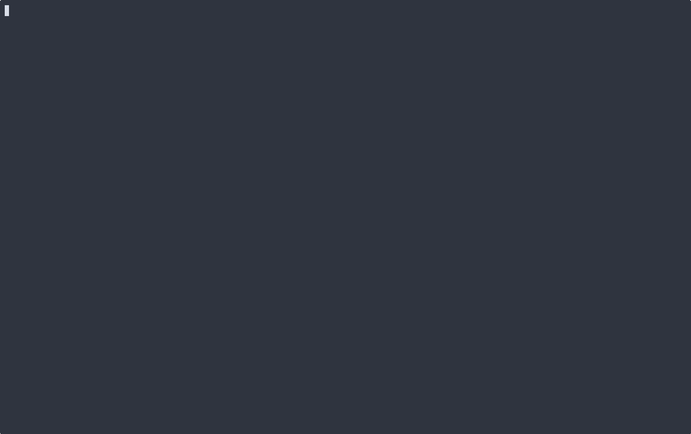
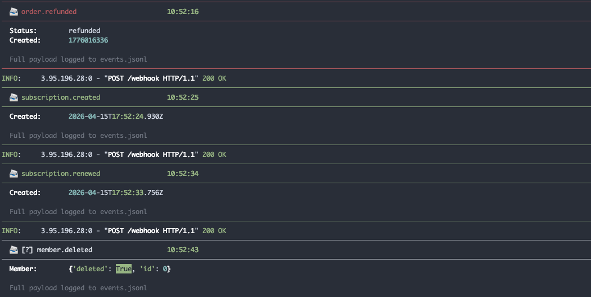
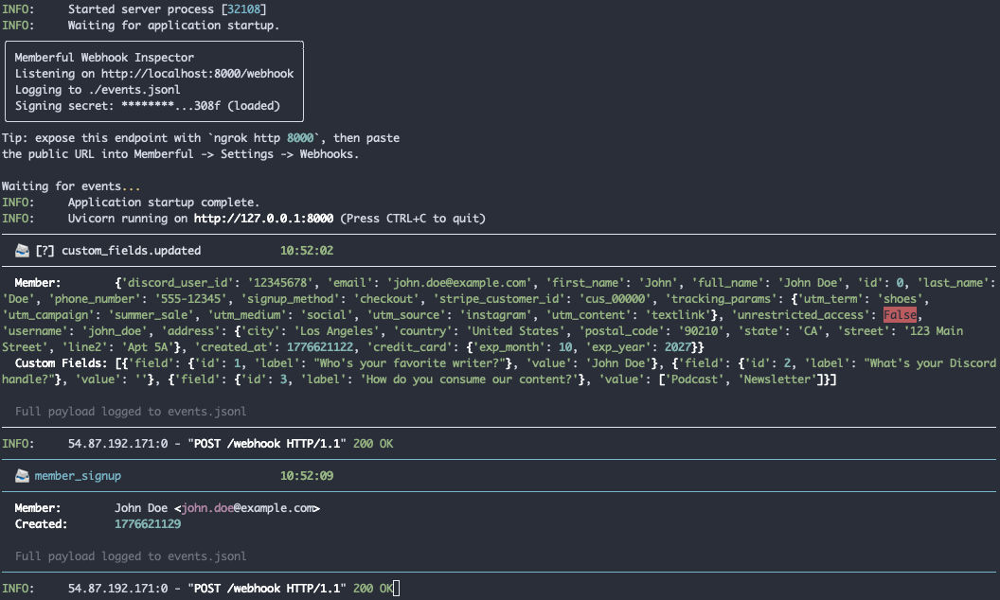

# Memberful Webhook Inspector

A local FastAPI receiver that verifies, pretty-prints, and logs Memberful webhook events while you test an integration.

## What It Looks Like



The inspector verifies incoming Memberful webhooks, prints a focused terminal summary, and writes the full payload to local JSONL logs.





## Why I Built This

I built this during a Memberful product trial to make it easier to see exactly what events fire and what fields arrive when testing webhook-driven workflows. It is meant to be the kind of focused support-engineering tool that helps debug a customer's integration quickly without standing up a dashboard. Small insight after running it: `[add one concrete Memberful behavior noticed during testing]`.

## Quickstart

```bash
git clone https://github.com/daryllundy/memberful-webhook-inspector
cd memberful-webhook-inspector
python3.11 -m venv .venv
source .venv/bin/activate
pip install -r requirements.txt
cp .env.example .env
```

Edit `.env` and set `MEMBERFUL_WEBHOOK_SECRET` to the signing secret from the Memberful webhook endpoint.

```bash
python -m inspector.app
```

In another terminal, expose the local endpoint:

```bash
ngrok http 8000
```

Paste the public `https://.../webhook` URL into Memberful under Settings -> Webhooks.

## Verification Walkthrough

Use Memberful's built-in webhook test button after configuring the ngrok URL, or send a signed local request:

```bash
BODY='{"event":"subscription.created","member":{"id":12345,"full_name":"John Doe","email":"john.doe@example.com"},"subscription":{"id":98765,"status":"active","autorenew":true,"created_at":"2025-09-15T22:07:48Z","plan":{"name":"Sample plan","price_cents":1000,"interval":"month"}}}'
SECRET='replace-with-memberful-webhook-signing-secret'
SIG=$(printf '%s' "$BODY" | openssl dgst -sha256 -hmac "$SECRET" -hex | awk '{print $NF}')
curl -i http://localhost:8000/webhook \
  -H "Content-Type: application/json" \
  -H "X-Memberful-Webhook-Signature: $SIG" \
  --data "$BODY"
```

Unsigned requests should fail:

```bash
curl -i http://localhost:8000/webhook \
  -H "Content-Type: application/json" \
  --data "$BODY"
```

## What Gets Logged

Verified events are printed to the terminal and appended to `events.jsonl`:

```text
─────────────────────────────────────────────────────
  📨 order.purchased                       14:31:05
─────────────────────────────────────────────────────
  Member:        John Doe <john.doe@example.com>
  Order ID:      456
  Total:         $10.00
  Status:        paid
  Created:       2026-04-18T21:31:05Z

  Full payload logged to events.jsonl
─────────────────────────────────────────────────────
```

```json
{"received_at":"2026-04-19T14:23:07.412Z","event":"subscription.created","signature_valid":true,"payload":{"event":"subscription.created","member":{"id":12345,"full_name":"John Doe","email":"john.doe@example.com"}}}
```

Missing or invalid signatures are appended to `events.invalid.jsonl` with request headers only. Invalid payload bodies are not logged.

## Security Notes

This is a local development tool, not a production-grade webhook gateway. It verifies the `X-Memberful-Webhook-Signature` header with HMAC-SHA256 over the raw request body bytes, compares signatures with `hmac.compare_digest()`, and rejects unsigned or incorrectly signed requests with `401`. Keep the `.env` file local and do not commit real Memberful signing secrets.

## Future Work

The following are intentionally out of scope for v1:

- SQLite storage for searchable local history.
- A web dashboard.
- Slack or Discord forwarding.
- A replay tool for previously logged events.
- A Docker image.

## License

MIT License

Copyright (c) 2026 Daryl Lundy

Permission is hereby granted, free of charge, to any person obtaining a copy of this software and associated documentation files (the "Software"), to deal in the Software without restriction, including without limitation the rights to use, copy, modify, merge, publish, distribute, sublicense, and/or sell copies of the Software, and to permit persons to whom the Software is furnished to do so, subject to the following conditions:

The above copyright notice and this permission notice shall be included in all copies or substantial portions of the Software.

THE SOFTWARE IS PROVIDED "AS IS", WITHOUT WARRANTY OF ANY KIND, EXPRESS OR IMPLIED, INCLUDING BUT NOT LIMITED TO THE WARRANTIES OF MERCHANTABILITY, FITNESS FOR A PARTICULAR PURPOSE AND NONINFRINGEMENT. IN NO EVENT SHALL THE AUTHORS OR COPYRIGHT HOLDERS BE LIABLE FOR ANY CLAIM, DAMAGES OR OTHER LIABILITY, WHETHER IN AN ACTION OF CONTRACT, TORT OR OTHERWISE, ARISING FROM, OUT OF OR IN CONNECTION WITH THE SOFTWARE OR THE USE OR OTHER DEALINGS IN THE SOFTWARE.
